# ORBIT

## Operator-guided Random-field Biomarker Immunophenotyping Training


ORBIT is an interactive Python program for supervised multiplex immunofluorescence (mIF) phenotyping.

The platform is designed for rapid, pathologist-guided biomarker training using random fields of view from whole-slide QPTIFF images. ORBIT enables users to visually inspect fluorescence channels, generate randomized image regions, label cellular phenotypes, and iteratively train machine-learning classifiers for immunophenotyping workflows.

---

# Features

- Interactive QPTIFF viewer
- Random field-of-view (FOV) generation
- Biomarker/channel selection
- Custom fluorescence color overlays
- Interactive, supervised machine-learning-based phenotyping
- Designed for multiplex pathology and spatial biology

---

# ORBIT Acronym

**O**perator-guided  
**R**andom-field  
**B**iomarker  
**I**mmunophenotyping  
**T**raining

---
# Standalone Installation

Download the latest release from the Releases tab. Installation requires ~1.7 GB disk space.

# Editable Installation

## Create Environment

```bash
conda create -n orbit python=3.11
conda activate orbit

```

## Clone and Install Repository

```bash
git clone https://github.com/M-Fotheringham/ORBIT

cd ORBIT

pip install -e .

```

## Making Modifications

*Before developing new features, create a branch*

```bash
git checkout -b feature/your-new-feature
```
Example:
```bash
git checkout -b feature/load_segmentation
```

*Test your changes in the app:*
```bash
python -m orbit.app
```

*Push your branch changes for review:*
```bash
git add .
git commit -m "single-line description"
git push
```


---

# User Guide

## 1. Loading

### 1.a Adding images to a project
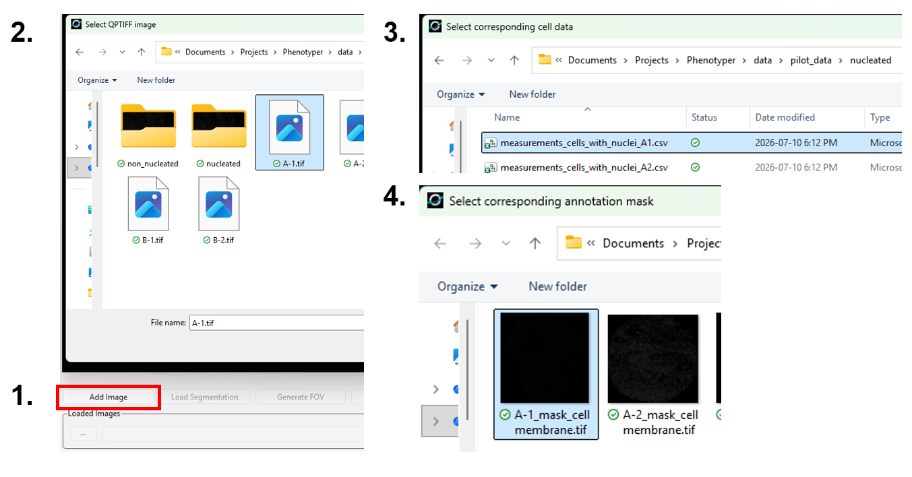

1. Click 'Add Image'
2. Select the tiff containing the fluorescence data
3. Select the CellPose segmentation data
4. Select the CellPose segmentation mask

### 1.b Opening a pre-existing project
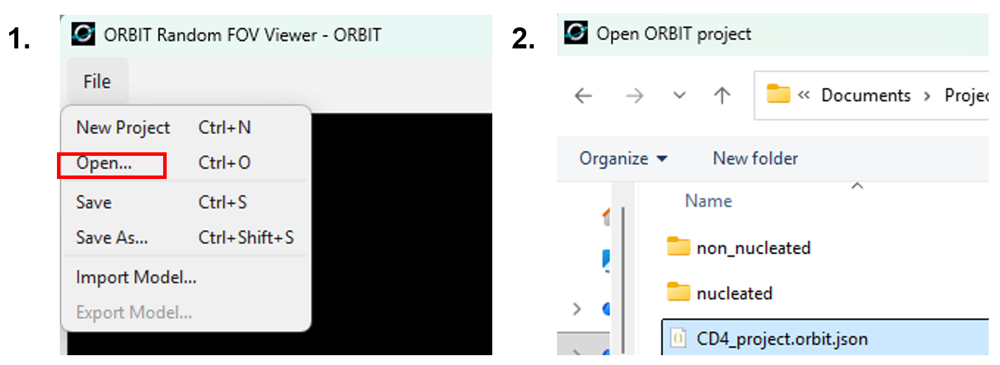

1. File > Open...
2. Select the .orbit.json file corresponding to your project

### 1.c Importing a pre-existing phenotyping model
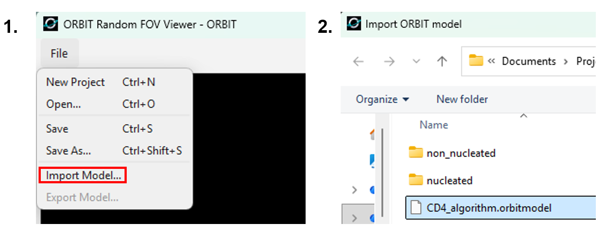

1. File > Import Model...
2. Select the .orbitmodel file corresponding to your model

## 2. Navigating

### 2.a Generating fields of view (FOV)
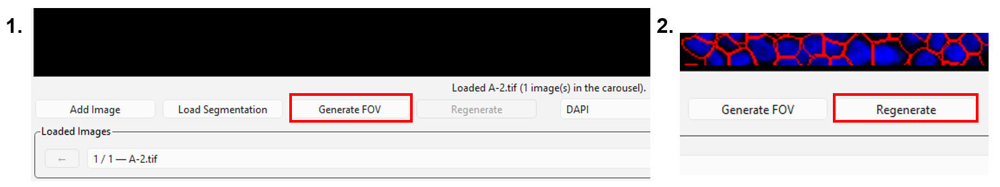

1. Click 'Generate FOV'. This will produce a random 512x512 px field of view
2. To generate additional fields, click 'Regenerate'

### 2.b Chaning the displayed marker channel and colour
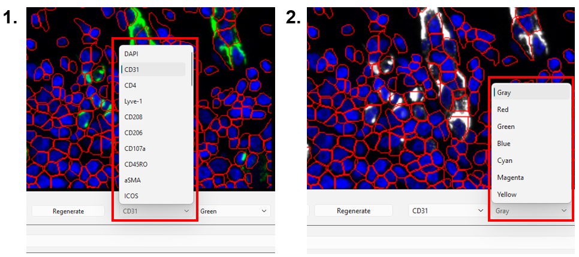

1. Use the marker dropdown list to select a channel
2. Use the colour dropdown list to select a pseudo colour for the marker

### 2.c Toggling DAPI and segmentation overlays


The DAPI stain and the segmentation can be toggled on/off.

### 2.d Cycling through images


Change the image displayed using the carousel arrows or by selecting an image from the dropdown list.

## 3. Phenotyping

### 3.a Adding and removing phenotype training labels
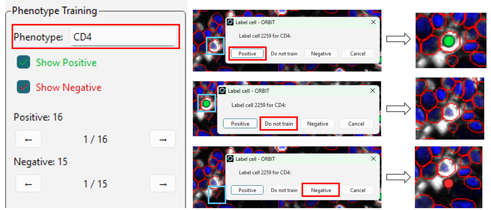

1. Provide a name for the phenotype algorithm being trained
2. Click on a cell to label it positive or negative for your desired phenotype. You can remove the cell from training by clicking it and selecting 'Do not train'.

### 3.b Training machine-learning phenotyping model
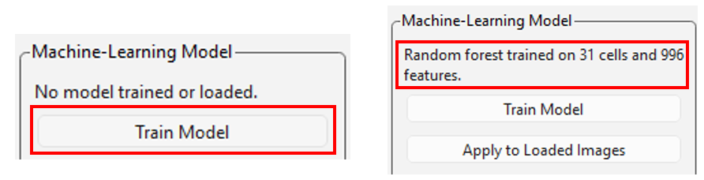

Once positive and negative labels have been selected, click 'Train Model' to train a random forest classifier.

### 3.c Quality-checking model performance and training labels
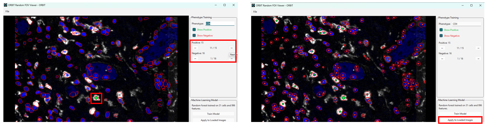

1. Cycle through labeled cells using the arrows in the 'Phenotype Training' box. This will centre the image on trained cells.
2. Once a model has been trained, click 'Apply to Loaded Images' to see the performance of the model on untrained cells.

## 4. Saving and Exporting

### 4.a Saving a project
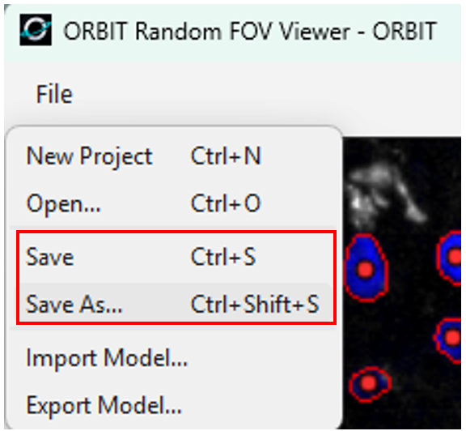

1. Click File > Save or Save As... to save a project. The image paths are saved to for retrieval upon reopening. Moving the images from their saved location will prevent the project from opening.

### 4.b Saving a phenotyping model
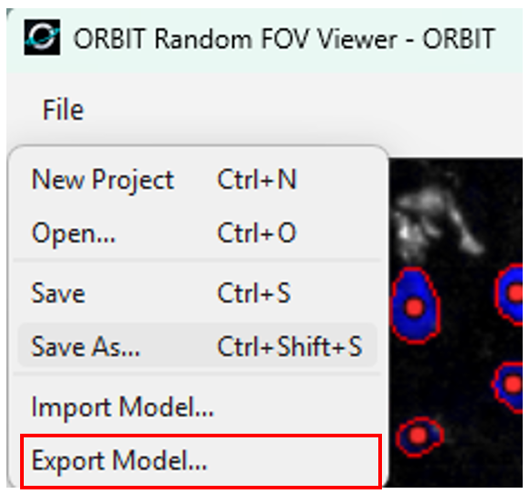

1. Click File > Export Model... to save a phenotyping model.

### 4.c Exporting phenotyping data
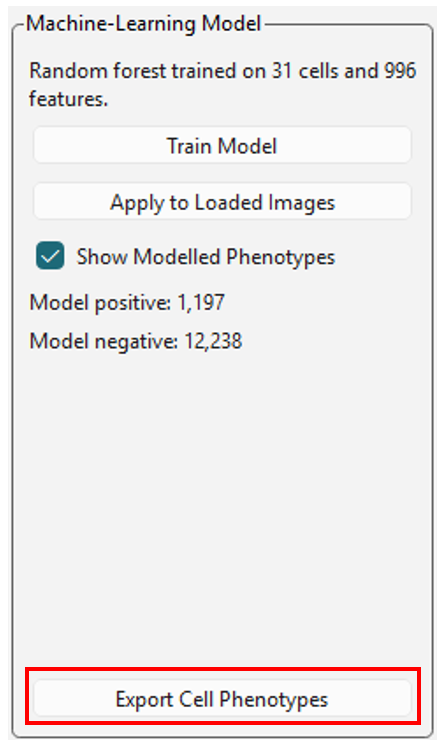

1. Once a model has been trained and applied to loaded images, click 'Export Cell Phenotypes' to save the CellPose output and phenotyping data for all cells in the loaded images.
