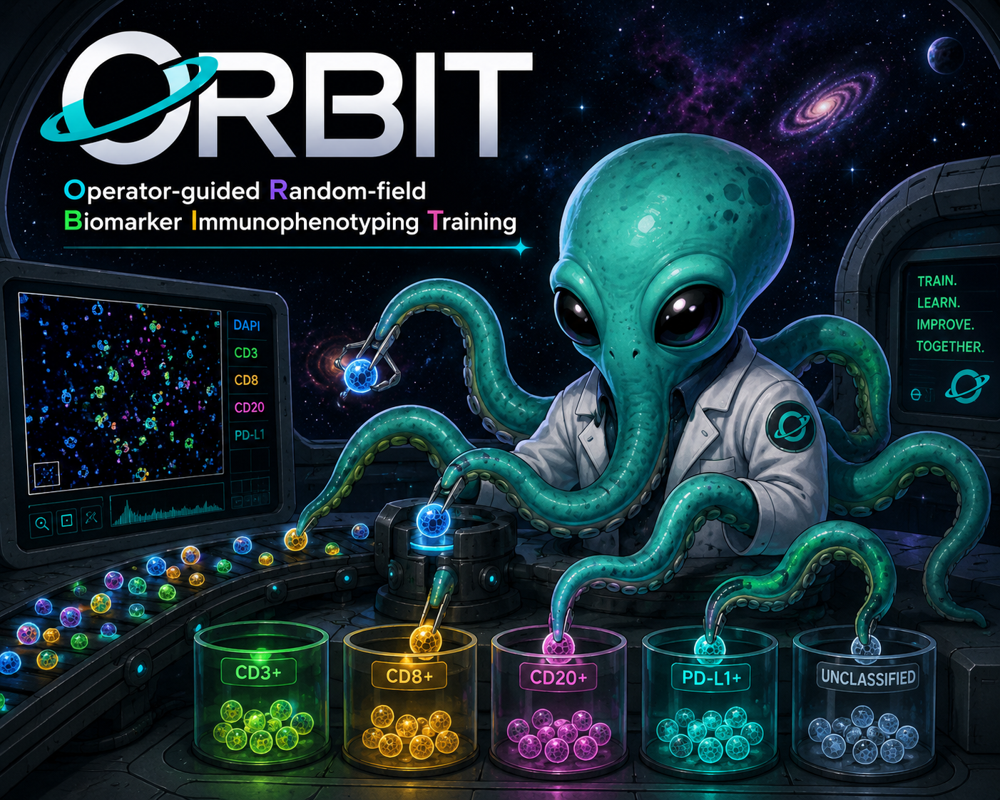

# ORBIT

## Operator-guided Random-field Biomarker Immunophenotyping Training



ORBIT is an interactive Python program for supervised multiplex immunofluorescence (mIF) phenotyping.

The platform is designed for rapid, pathologist-guided biomarker training using random fields of view from whole-slide QPTIFF images. ORBIT enables users to visually inspect fluorescence channels, generate randomized image regions, label cellular phenotypes, and iteratively train machine-learning classifiers for immunophenotyping workflows.

---

# Features

- Interactive QPTIFF viewer
- Random field-of-view (FOV) generation
- Biomarker/channel selection
- Real biomarker names from QPTIFF metadata
- Custom fluorescence color overlays
- Persistent DAPI overlay
- Fast channel switching
- Asynchronous image loading with GUI spinner
- Foundation for supervised phenotyping workflows
- Designed for multiplex pathology and spatial biology

---

# ORBIT Acronym

**O**perator-guided  
**R**andom-field  
**B**iomarker  
**I**mmunophenotyping  
**T**raining

---

# Installation

## Create Environment

```bash
conda create -n orbit python=3.11
conda activate orbit

```

## Clone and Install Repository

```bash
git clone https://github.com/M-Fotheringham/ORBIT

cd ORBIT

pip install -e .

```

## Making Modifications

*Before developing new features, create a branch*

```bash
git checkout -b feature/your-new-feature
```
Example:
```bash
git checkout -b feature/load_segmentation
```

*Test your changes in the app:*
```bash
python -m orbit.app
```

*Push your branch changes for review:*
```bash
git add .
git commit -m "single-line description"
git push
```
