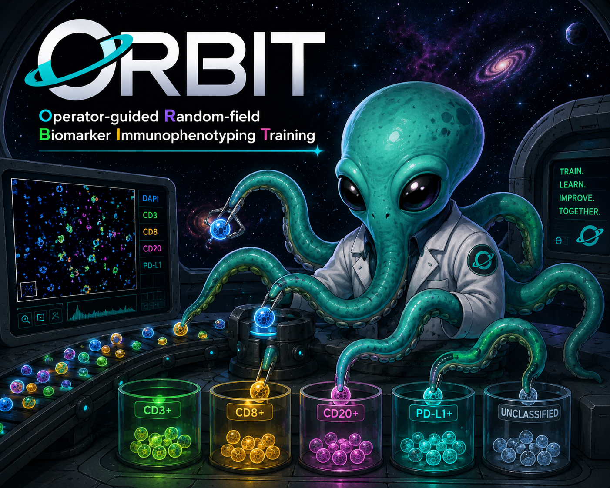

# ORBIT

[](https://github.com/M-Fotheringham/ORBIT/releases)
[](https://www.python.org/)
[](https://docs.astral.sh/uv/)

## Operator-guided Random-field Biomarker Immunophenotyping Training



ORBIT is an interactive desktop application for supervised phenotyping of multiplex immunofluorescence images. It combines CellPoseSAM cell segmentation and machine-learning cell classification in one pathologist-friendly workflow.

Review segmentation quality, training labels, and phenotype calls before using exported results in downstream analyses.

## Highlights

- Load multiple TIFF, QPTIFF, or local OME-Zarr images into one project.
- Navigate 512 × 512-pixel fields of view (FOVs) and jump anywhere in the source image with the clickable whole-image overview.
- Import existing cell-level measurements and label masks, or generate both with CellPoseSAM.
- Train phenotypes manually with a random forest model or by fluorescence thresholds, or have ORBIT automatically assign cell labels that can be reviewed and edited.
- Save projects, import/export reusable phenotype models, export generated segmentation, and export cell-level phenotype tables.

## ORBIT acronym

**O**perator-guided  
**R**andom-field  
**B**iomarker  
**I**mmunophenotyping  
**T**raining

## Requirements

### Running ORBIT

- Python 3.11
- Astral's uv package manager

### Running CellPoseSAM segmentation

CellPoseSAM segmentation requires an NVIDIA GPU that PyTorch can access through CUDA. ORBIT reports GPU availability at the top of the **Segmenting > CellPoseSAM** panel and disables the segmentation controls when a compatible GPU is not detected. It would otherwise run for hours, if given a whole-slide image.

An AMD GPU is not CUDA-compatible; however, you can still load images, import existing segmentation, navigate FOVs, phenotype cells, and export results without a CUDA GPU.

## Installation

### Windows standalone application

Download the latest installer for Windows from [Windows Installer (Releases)](https://github.com/M-Fotheringham/ORBIT/releases).

### Editable source installation with uv

ORBIT 1.2.0 uses [uv](https://docs.astral.sh/uv/) and a `uv.lock` file to manage its environment. You do not need to create or activate a conda environment.

1. Install [Git](https://git-scm.com/downloads) and [uv](https://docs.astral.sh/uv/getting-started/installation/).

   On Windows, uv can be installed from PowerShell with WinGet:

   ```powershell
   winget install --id=astral-sh.uv -e
   ```

2. Clone and enter the repository:

   ```powershell
   git clone https://github.com/M-Fotheringham/ORBIT.git
   cd ORBIT
   ```

3. Create/synchronize the project environment from the lockfile:

   ```powershell
   uv sync --locked
   ```

4. Start ORBIT:

   ```powershell
   uv run orbit
   ```

### Updating a source checkout

```powershell
git pull
uv sync --locked
uv run orbit
```

## Supported data

### Images

ORBIT can add:

- `.qptiff`, `.tif`, and `.tiff` files through **TIFF / QPTIFF**;
- a local OME-Zarr directory through **OME-Zarr directory**.

Channel names are read from image metadata when available. A channel whose name contains `DAPI` is used for the nuclear overlay, DAPI-positive FOV selection, and the CellPoseSAM nuclear input. For OME-Zarr data with time or Z dimensions, ORBIT currently displays the first time point and first Z plane.

### Existing segmentation

Segmentation is optional when an image is first added. To import it later, select the image in the carousel and click **Load Segmentation**. ORBIT then asks for:

1. a non-empty cell-data table (`.tsv`, `.txt`, or `.csv`); and
2. a two-dimensional labelled mask (`.tif` or `.tiff`) with the same width and height as the image.

ORBIT was designed to read [CellPose](https://github.com/mouseland/cellpose) segmentation data.

## Quick start

1. Click **Add Image**, choose **TIFF / QPTIFF** or **OME-Zarr directory**, and select the image.
2. Add more images if required; use the bottom carousel to select the active image.
3. For each image, either click **Load Segmentation** to import a cell table and mask, or run **Segmenting > CellPoseSAM** once the project images are loaded.
4. Click **Generate FOV** and choose the fluorescence marker and pseudocolour to display.
5. Choose **Phenotyping > Automated**, **Random Forest**, or **Threshold Slider**.
6. Review calls, correct labels where appropriate, and apply the result to all loaded images.
7. Save the project and export the model and/or cell phenotype table.

## User guide

### 1. Projects and images

#### 1.1 Add images

1. Click **Add Image**.
2. Choose **TIFF / QPTIFF** or **OME-Zarr directory**.
3. Select the image file or OME-Zarr directory.
4. Repeat to add more images. Use the arrows or dropdown in **Loaded Images** to change the active image.
5. If existing segmentation is available, select the corresponding image, click **Load Segmentation**, then select its cell-data table and label-mask TIFF.

Loading a new segmentation for an image clears that image's existing annotations and phenotype predictions.

#### 1.2 Open or save a project

- **File > New Project** clears the current session after confirmation.
- **File > Open...** opens an `.orbit.json` project.
- **File > Save** updates the current project file.
- **File > Save As...** writes a new `.orbit.json` project.

A project records absolute paths to its images, cell tables, and masks, together with training annotations, selected markers, FOV positions, overlay visibility, threshold settings, and the active tool. It does not embed the source data or a trained model. Keep the referenced files in place, and use **File > Export Model...** separately if the classifier must be reused.

#### 1.3 Import a phenotype model

1. Load images and segmentation whose cell tables contain the same feature columns used by the model.
2. Choose **File > Import Model...**.
3. Select an `.orbitmodel` file.
4. Choose **Phenotyping > Random Forest** and click **Apply to Loaded Images**.

### 2. Navigate and display images

#### 2.1 Generate a field of view

- **Generate FOV** creates a random 512 × 512-pixel field containing at least 1% DAPI-positive pixels.
- **Regenerate** samples another qualifying field.
- If no qualifying field is found after repeated attempts, check that a valid DAPI channel is present and contains measurable nuclear signal.

#### 2.2 Change marker channel and colour

Use the marker dropdown to select the displayed fluorescence channel and the colour dropdown to choose its pseudocolour. The selected fluorescence channel is also the channel used by Threshold Slider and Automated phenotyping.

#### 2.3 Toggle overlays

- **DAPI** shows or hides the nuclear channel.
- **Segmentation** shows or hides cell boundaries when a mask is loaded.
- **Overview** shows or hides the low-power whole-image navigator in the upper-left corner.

The overview displays the current FOV as a red rectangle. Click anywhere in it to centre the FOV on that part of the source image.

#### 2.4 Move between images

Use the carousel arrows or the **Loaded Images** dropdown at the bottom of the window. Training annotations are stored per image and pooled across the loaded project when a random forest is trained.

### 3. Segment with CellPoseSAM

1. Add all images to the project.
2. Choose **Segmenting > CellPoseSAM**.
3. Confirm that the status light says **CUDA-compatible GPU detected**. If it does not, the marker list and segmentation actions remain disabled.
4. Select one or more membrane-guiding markers shared by the loaded images. ORBIT robustly normalizes and merges the selected fluorescence channels into one membrane input. DAPI is supplied separately as the nuclear channel when available.
5. Click **Segment**.

ORBIT runs the `cpsam_v2` CellPoseSAM model on every loaded image, generates a labelled cell mask, and calculates morphology plus per-channel fluorescence measurements for every cell. Generated segmentation replaces any segmentation, training annotations, and predictions currently associated with those images.

The generated files are written beside each source image as:

- `<image>_orbit_cellpose_cells.tsv`
- `<image>_orbit_cellpose_masks.tif`

To copy all CellPoseSAM outputs to another location, click **Export Segmentation** at the bottom of the panel and select a destination directory.

### 4. Phenotype cells

All phenotyping modes require cell data and a segmentation mask for every loaded image. Name the phenotype before training or exporting it.

#### 4.1 Automated (default)

1. Select the fluorescence marker that represents the phenotype and generate an FOV.
2. Choose **Phenotyping > Automated** if it is not already active.
3. Enter a phenotype name and click **Auto Phenotype**.
4. Review the modelled calls on every loaded image.

Automated phenotyping starts from a 66% fluorescence-intensity threshold and a 15% positive-pixel cutoff. It deterministically selects 25 positive and 25 negative examples, performs two low-confidence refinement rounds that add five cells to each class per round, trains a final 35-positive/35-negative random forest, and applies it to all loaded images. The fixed random seed makes the automatic selections repeatable for the same ordered input data.

Click **Edit** to expose the threshold settings and the generated random-forest training labels. You can change thresholds, click cells to set **Positive**, **Negative**, or **Do not train**, use the arrows to review training cells, and click **Re-Phenotype** to retrain and reapply the model.

#### 4.2 Random Forest

1. Choose **Phenotyping > Random Forest**.
2. Enter the phenotype name.
3. Click segmented cells and label each one **Positive**, **Negative**, or **Do not train**.
4. Use **Show Positive** and **Show Negative** to toggle the training markers.
5. Use the positive and negative arrow controls to centre the FOV on each labelled cell.

Click **Train Model** after labelling at least one positive and one negative cell. ORBIT trains a 300-tree random forest from numeric measurement columns shared by every loaded cell table. Identifier, centroid, geometry, bounding-box, ROI, and existing label/classification columns are excluded from training.

Click **Apply to Loaded Images** to phenotype every cell. Toggle **Show Modelled Phenotypes** to hide or show model calls. Hover over a segmented cell for two seconds to display the model's positive-call probability above the cursor.

#### 4.3 Threshold Slider

1. Choose **Phenotyping > Threshold Slider** and select the fluorescence channel to evaluate.
2. Use the first histogram and slider to inspect the whole current image's mean per-cell fluorescence distribution and set the pixel-intensity threshold. Pixels above the threshold are highlighted yellow; use **Threshold Mask: On/Off** to toggle this overlay.
3. Use the second histogram and slider to inspect the whole current image's distribution of positive-pixel percentages and set the percentage required to call a cell positive.
4. Choose the denominator compartment:
   - **Nucleus** uses pixels deeper inside the membrane boundary than the selected inward distance.
   - **Cytoplasm/Membrane** uses pixels within that distance of the boundary.
   - selecting both uses all cell pixels.
5. Adjust the inward boundary distance from 0 to 5 µm. The default is 2 µm. This is a geometric split of the cell mask, not an independently segmented nuclear mask.
6. Click **Apply Threshold to All Cells**.

Use **Show Threshold Phenotypes** to toggle the resulting calls. Threshold results can be exported after every loaded image has been processed.

### 5. Save and export results

#### 5.1 Save the project

Choose **File > Save** or **File > Save As...**. Because `.orbit.json` files store paths rather than source data, moving or renaming a referenced image, cell table, mask, or OME-Zarr directory prevents that item from reopening until the original path is restored.

#### 5.2 Export or import a random-forest model

- **File > Export Model...** writes the trained classifier and its feature schema to an `.orbitmodel` file.
- **File > Import Model...** loads that model into another project.

The receiving images must have cell tables containing the feature columns stored in the model. Importing a model does not automatically apply it; click **Apply to Loaded Images** after import.

#### 5.3 Export cell phenotypes

After a model or threshold has been applied to every loaded image, click **Export Cell Phenotypes** and choose TSV or CSV output.

The combined export contains:

- every original column from every loaded cell-data table;
- the source image name;
- the named phenotype's `Positive` or `Negative` label; and
- the label source (`Model`, `Threshold`, or `Manual Training`).

If the source tables have different schemas, ORBIT exports the union of their columns and leaves unavailable values empty.

## Development

Create a branch before making changes:

```powershell
git checkout -b feature/your-feature
```

Synchronize the locked environment and run the application from the checkout:

```powershell
uv sync --locked
uv run orbit
```

If dependencies in `pyproject.toml` change, refresh and verify the lockfile:

```powershell
uv lock
uv sync
```

Build the Python source distribution and wheel with:

```powershell
uv build
```

`uv build` writes Python package artifacts to `dist/`; it does not create a standalone Windows executable or installer.

Commit and push the branch for review:

```powershell
git add .
git commit -m "Describe the change"
git push -u origin feature/your-feature
```

## Troubleshooting

### The CellPoseSAM panel is disabled

ORBIT could not detect an NVIDIA CUDA GPU through PyTorch. Confirm that the NVIDIA driver is installed, then start ORBIT from the same uv environment in which its CUDA-enabled PyTorch build is installed. A CPU or AMD-only system can use imported segmentation but cannot run the current CellPoseSAM workflow.

### A project no longer opens its data

The project stores absolute paths. Restore the images, OME-Zarr directories, cell tables, and masks to their saved locations, or add them again and save a new project.

### A cell table cannot be mapped to the mask

Confirm that the mask is two-dimensional and matches the image dimensions. The table should include numeric cell IDs matching the positive mask labels, or valid X/Y centroid coordinates located inside or close to each segmented cell.

### Random FOV generation cannot find tissue

Confirm that the nuclear channel name contains `DAPI`, that the channel is not blank, and that the image contains fields with at least 1% DAPI-positive pixels.

## Repository layout

```text
ORBIT/
├── docs/figs/                  # Logos and tutorial images
├── src/orbit/
│   ├── app.py                  # Qt application entry point
│   ├── fov.py                  # DAPI-guided random FOV sampling
│   ├── image.py                # TIFF/QPTIFF and OME-Zarr access
│   ├── threshold.py            # Pixel/cell threshold statistics
│   ├── gui/
│   │   ├── fov_viewer.py       # Main window and user workflows
│   │   └── napari_canvas.py    # Interactive image canvas
│   └── models/
│       ├── automated.py        # Deterministic automated label selection
│       ├── cellpose_segmentation.py
│       └── random_forest.py
├── pyproject.toml
└── uv.lock
```

## Questions and bug reports

Open an issue in the [GitHub issue tracker](https://github.com/M-Fotheringham/ORBIT/issues) and include the ORBIT version, operating system, image format, steps to reproduce, and the full error message or traceback.
